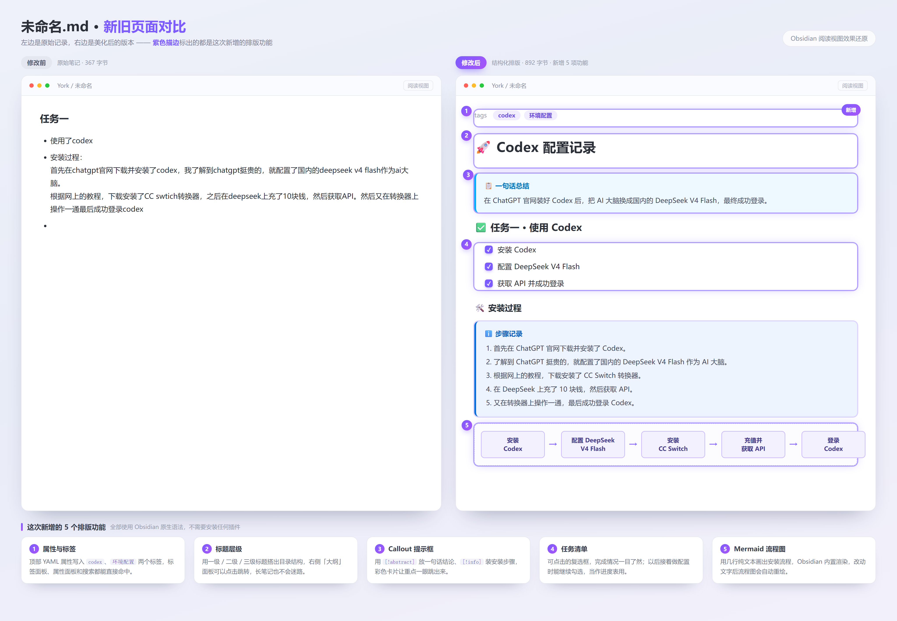

---
tags:
  - codex
  - 环境配置
  - agent
---

# 🚀 Codex 配置记录

> [!abstract] 一句话总结
> 在 ChatGPT 官网装好 Codex 后，把 AI 大脑换成国内的 DeepSeek V4 Flash，最终成功登录。

## ✅ 任务一 · 使用 Codex

- [x] 安装 Codex
- [x] 配置 DeepSeek V4 Flash
- [x] 获取 API 并成功登录

### 🛠️ 安装过程

> [!info] 步骤记录
> 1. 首先在 ChatGPT 官网下载并安装了 Codex。
> 2. 了解到 ChatGPT 挺贵的，就配置了国内的 DeepSeek V4 Flash 作为 AI 大脑。
> 3. 根据网上的教程，下载安装了 CC Switch 转换器。
> 4. 在 DeepSeek 上充了 10 块钱，然后获取 API。
> 5. 又在转换器上操作一通，最后成功登录 Codex。

### 📌 第一个小任务：美化这篇笔记

- [x] 让 Codex 把这篇笔记重新排版
- [x] 用 git 记录改动过程

> [!example] 美化前后对比

> [!example] git diff 的结果

> [!quote] 一点感想
> 好吧，AI 的功能确实很强大。说实话我看到这个效果还是很焦虑的，毕竟作为一个 0 基础的人看到 AI 轻轻松松地完成了自己做不到的事，不禁在想 AI 冲击下未来的路又该怎么走（这方面挺想和学长学姐交流的）。

---

## 🧠 任务二 · 理解 Agent

### 🤖 1. Agent 为什么能够读取文件、修改代码，而普通聊天 AI 通常不能？

> [!success] Agent 是能动手的
> 多了工具、多了操作权限，所以它才能真的读文件、改代码，而不只是说要怎么改。而普通 AI 只是纯文本生成，只可以回答问题和聊天。

### 🛠️ 2. Tool 在 Agent 中起到了什么作用？

> [!important] Tool 是 Agent 与外部世界之间的唯一接口
> 它把 LLM 大模型的推理能力转化为对外部世界的实际操作与反馈。
>
> 没有 Tool，LLM 只是一个会聊天的函数；有了 Tool，它才成为一个能作用于世界的 Agent。

### 📜 3. 为什么项目需要给 Agent 配置一份类似“员工手册”的规则？

> [!tip] 因为 LLM 有能力，却没有项目的上下文和规矩
> 手册把项目常识、行为边界、工作流程、风格约定一次性注入，让它从一个“通用聪明人”变成一个“懂规矩、能放心交付的员工”。

### 🧠 4. Agent 为什么可能“忘记”之前说过的内容？额度是怎么算的？

> [!question] 为什么会忘：根本原因是 LLM 本身没有记忆
> 感觉它“记得”是因为宿主程序在每一轮请求时，把之前的对话原文模型重新读了一遍，看起来像记得。但这种“重读”受限于上下文窗口的硬性上限。每一轮对话、每次工具调用结果、每个读过的文件都会累积在窗口里，一旦总量超过上限，最早的内容就会被挤出，Agent 就“忘记”了。

> [!important] 额度怎么算：费用 = 输入 token 数 × 输入单价 + 输出 token 数 × 输出单价
> 额度的本质是 token 消耗量，核心逻辑是“输入 token + 输出 token，按各自单价累加”。
>
> Token 是模型处理文本的基本单位，粗略估算 1 token ≈ 4 个英文字符，中文约 1 个汉字 ≈ 1.16 token。标准 API 计费按每百万 token 标价，输入和输出分开算。

### ⚠️ 5. 如果一个 Agent 可以随便执行任何终端命令，会有什么风险？

> [!warning] 等于把一个拥有完整权限的决策器放进真实环境
> 让 Agent 随意执行终端命令，等于把一个可能被诱导、且不完全理解后果的决策器，放进了拥有完整权限的真实环境里。
>
> **它可能：**
> - 误删数据
> - 泄露凭证
> - 被注入攻击
> - 烧光资源
> - 破坏生产系统
>
> 因此必须通过最小权限、沙箱隔离、命令约束和人工确认来限制它的执行能力。
